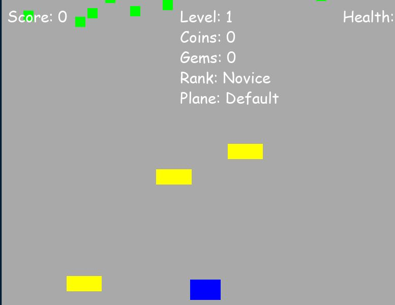

# Ultimate Plane Game Deluxe

Welcome to the Ultimate Plane Game Deluxe! Fly through levels, defeat enemies, and become the top ace pilot. Here's how to get started.

## Controls

- **Movement**: 
  - Arrow Keys: Move the plane.
- **Shooting**: 
  - Spacebar: Fire bullets.
- **Shop**: 
  - Press `E` to enter the shop.
  
## Gameplay Overview

- **Objective**: 
  - Shoot down enemies and avoid collisions to progress through levels.
  - Collect coins and gems to upgrade your plane and weapons.
  - Defeat mini-bosses and bosses that appear every few levels.

- **Health**: 
  - Starts at 5. Avoid enemy collisions to maintain it. Game over if it reaches 0.

- **Power-Ups**: 
  - Collect power-ups to restore health or upgrade weapons.

- **Levels**: 
  - Face increasingly difficult enemies as you advance.
  - Every 5 levels, encounter a mini-boss. Every 10 levels, battle a boss.

- **Day/Night Cycle & Weather**: 
  - Experience changing day/night cycles and random weather effects like wind or rain.

- **Shop**: 
  - Buy health, weapons, and abilities with coins and gems collected during gameplay.

## Achievements & Ranking

- **Achievements**: 
  - Unlock achievements by reaching score milestones.
  - Earn extra coins for unlocking achievements.

- **Ranking**: 
  - Your rank increases with your score, starting from Novice.

## Saving & Loading

- **Save Game**: 
  - Progress is automatically saved after each game session.
  
- **Load Game**: 
  - Automatically loads your last saved game upon starting.

## Getting Started

1. Install Python and Pygame (`pip install pygame`).
2. Run the game script with `python plane_game.py`.

Enjoy your flight!

